# Qt6 Natvis

This repository is a test suite for my changes to the official Qt6 natvis file that can be found here:
[qt6.natvis](https://code.qt.io/cgit/qt-labs/vstools.git/plain/QtMSBuild/QtMsBuild/qt6.natvis.xml).

Note that I removed the `##NAMESPACE##::` from the type name, as this file is parsed and updated by the
[Qt Visual Studio Tools](https://marketplace.visualstudio.com/items?itemName=TheQtCompany.QtVisualStudioTools2022).

## Changes

### QMap

|          `QMap` before          |          `QMap` after          |
|:-------------------------------:|:------------------------------:|
| 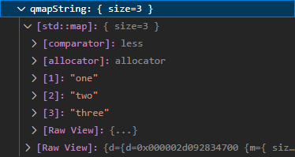 |  |
|   Comparison with `std::map`    |  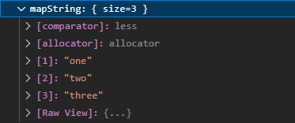   |

### QHash

|            `QHash` before            |                  `QHash` after                  |
|:------------------------------------:|:-----------------------------------------------:|
|  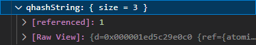   |        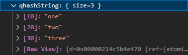         |
| Comparison with `std::unordered_map` | 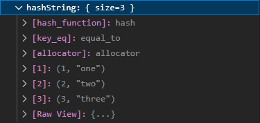 |

### QMultiHash

| `QMultiHash` before (with `QHash` improvements) |                    `QMultiHash` after                     |
|:-----------------------------------------------:|:---------------------------------------------------------:|
|   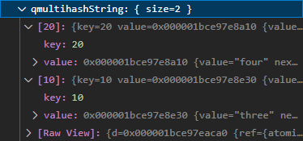   |        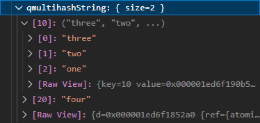         |
|    Comparison with `std::unordered_multimap`    | 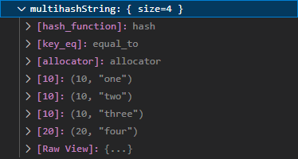 |

There's a difference between `QMultiHash` and `std::unordered_multimap` as it's not possible to display
`QMultiMap` as its std equivalent.

Note that the current representation is closest to the `QMultiHash` API anyway: it's a list of
`[key, list<value>]` (so size is 2 here), not a list of `[key, value]` (with a size of 4).

### QSet

| `QSet` before (with `QHash` improvements) |                  `QSet` after                   |
|:-----------------------------------------:|:-----------------------------------------------:|
|      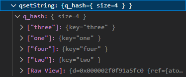      |      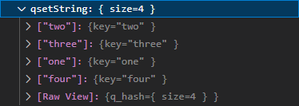       |
|   Comparison with `std::unordered_set`    | 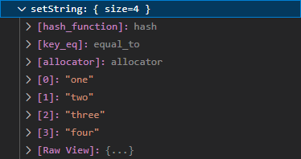 |

### QVariant

### Unknown type

If the type is unknown, it will show at least the `typeId`, so the developer can know what is inside
the `QVariant`.

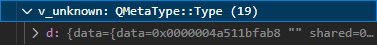

### Static primitives types

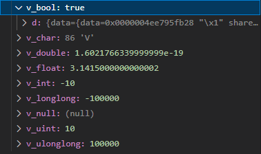

All types handled:

- `QMetaType::Bool`
- `QMetaType::Int`
- `QMetaType::UInt`
- `QMetaType::LongLong`
- `QMetaType::ULongLong`
- `QMetaType::Double`
- `QMetaType::VoidStar`
- `QMetaType::Long`
- `QMetaType::Short`
- `QMetaType::Char`
- `QMetaType::Char16`
- `QMetaType::Char32`
- `QMetaType::ULong`
- `QMetaType::UShort`
- `QMetaType::UChar`
- `QMetaType::Float`
- `QMetaType::SChar`

### Static Core types

It's also possible to see directly the members for the type by expanding the view.

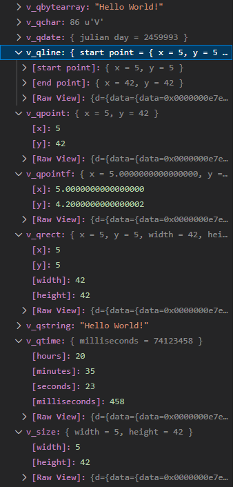

All types handled:

- `QMetaType::QChar`
- `QMetaType::QString`
- `QMetaType::QByteArray`
- `QMetaType::QDate`
- `QMetaType::QTime`
- `QMetaType::QRect`
- `QMetaType::QSize`
- `QMetaType::QLine`
- `QMetaType::QPoint`
- `QMetaType::QPointF`

### Static Core Template types

Like previously, you can see directly the items for the type by expanding the view.

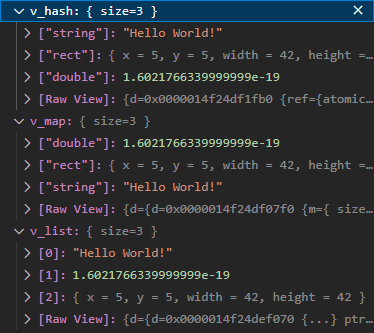

All types handled:

- `QMetaType::QVariantMap`
- `QMetaType::QVariantList`
- `QMetaType::QVariantHash`
- `QMetaType::QByteArrayList`
- `QMetaType::QStringList`
